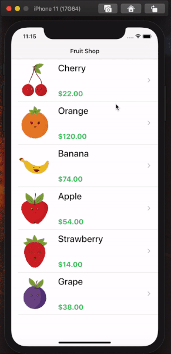

# Apple Pay Fruits

Esse projeto implementa o **Apple Pay** em um aplicativo, seguindo o nosso tutorial disponível em https://medium.com/@henriqueconte/criando-aplicação-completa-utilizando-o-apple-pay-ef6c14d49669. Na branch **Master** está o projeto inicial, e na branch **PaymentiOS** está a versão final do projeto. 

# Features

* Apple Pay
* Stripe
* PassKit

